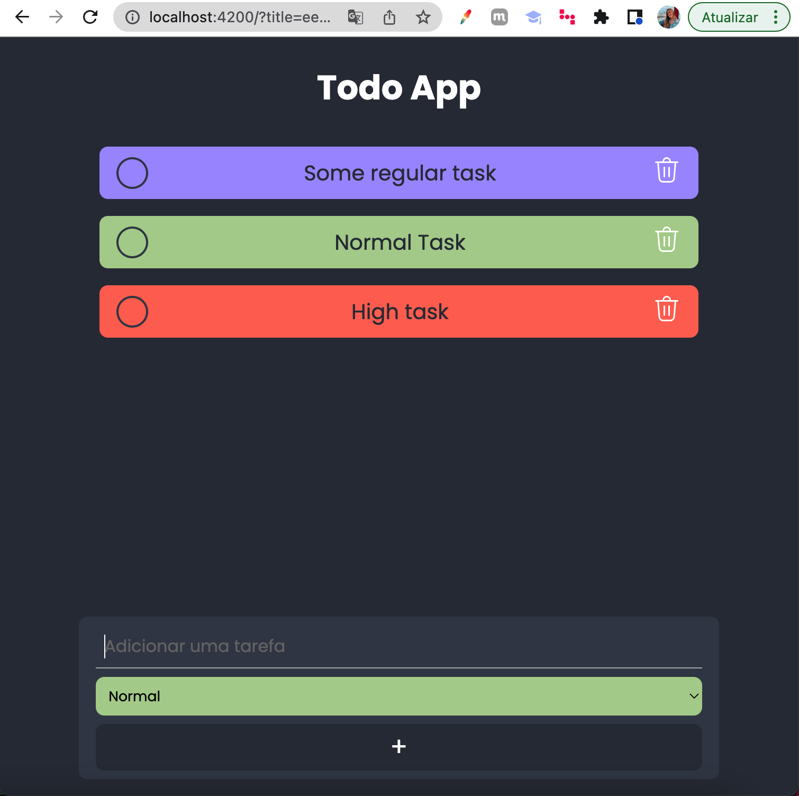
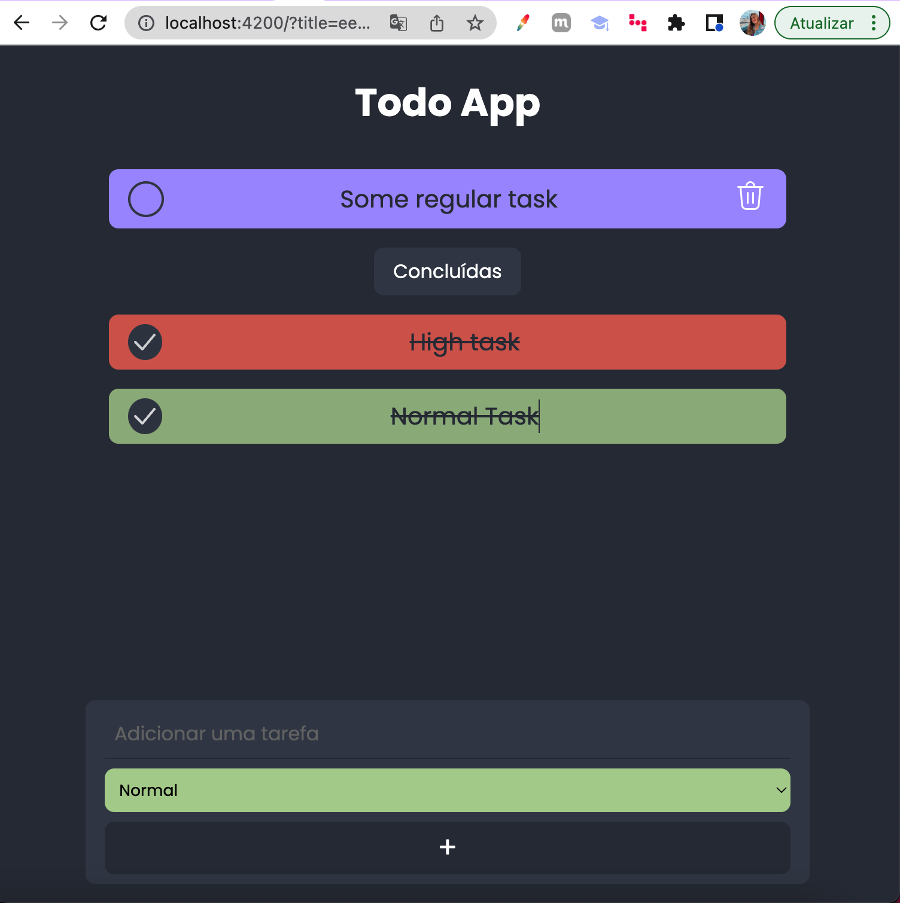

<h1 align="center" style="font-weight: bold;">ToDo ✔️</h1>


<p align="center">
 <a href="#tech">Technologies</a> • 
 <a href="#started">Getting Started</a> • 
 <a href="#contribute">Contribute</a> •
 <a href="#license">License</a>
</p>

<p align="center">
<b>This application is an ToDo App, where users can create their activities 
separating them by priority (light, normal, medium, high), and then delete or complete the activities.</b>
</p>

<p align="center">
  
  
</p>

<h2 id="tech">Technologies</h2>

Built using [Angular JS](https://docs.angularjs.org/guide/services), this interface and the layout ware made from scratch by me.

Applying concepts such as
- Interpolation
- Property binding
- Services
- Two way data-binding

<h2 id="started">🚀 Getting Started</h2>

<h4> Prerequisites</h4>

- Node 14
- Git 2
- Angular CLI

<h4>Install project</h4>

```
git clone https://github.com/Fernanda-Kipper/text-editor.git
npm install
```

<h4>Start server</h4>

```
  //in root
  ng serve
```

<h2 id="contribute">👩‍💻 Contribute</h2>

If you want to contribute, clone this repo, create your work branch and get your hands dirty!

```bash
git clone https://github.com/Fernanda-Kipper/text-editor.git
git checkout -b feature/NAME
```

 At the end, open a Pull Request explaining the problem solved or feature made, if exists, append screenshot of visual modifications and wait for the review!

[How to create a Pull Request](https://www.atlassian.com/br/git/tutorials/making-a-pull-request)

[Commit pattern](https://gist.github.com/joshbuchea/6f47e86d2510bce28f8e7f42ae84c716)


<h2 id="license">📃 License</h2>

This project is under [MIT](./.github/LICENSE) license


